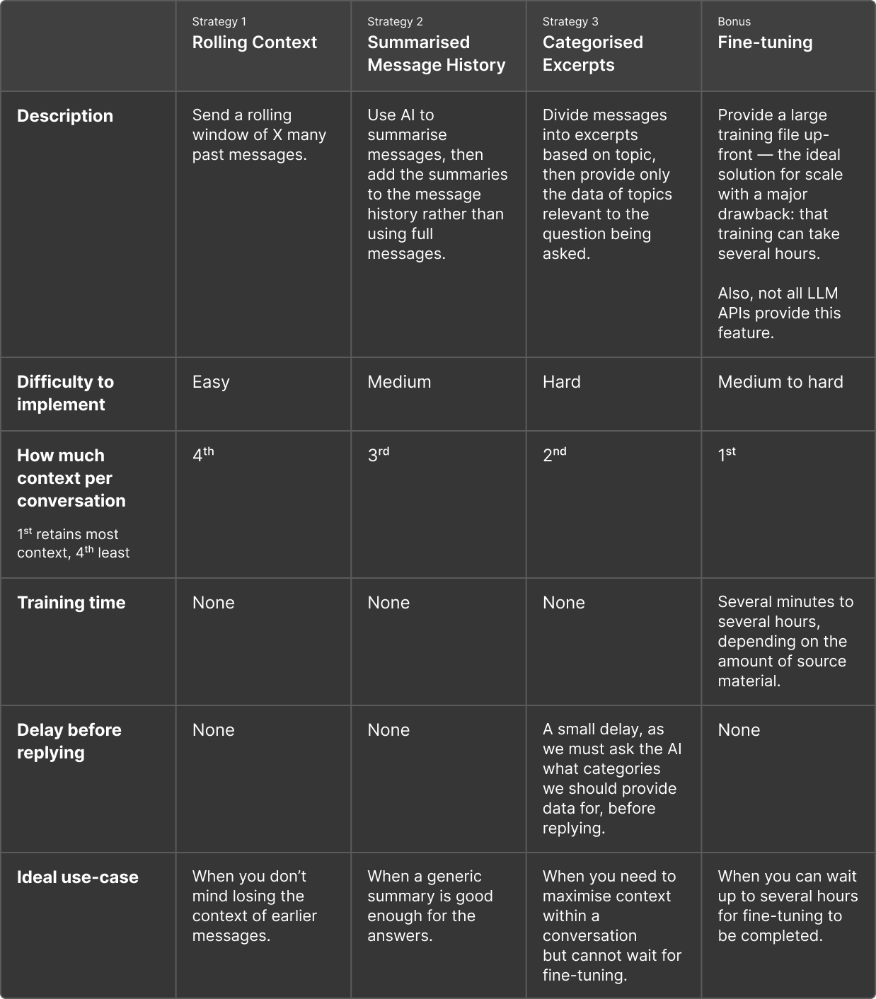

# Node.js OpenAI ‘Memory System’ Tutorial

In this project, you can see three approaches to overcoming conversation token limits using OpenAI’s API — as well as a basic example of how to have a conversation with an LLM in the terminal.

## Installation

To run the examples, ensure you have [Node.js installed](https://nodejs.org/en).

Then, clone the repository and install the dependencies:

```bash
npm install
```

## Configuration

Create a `.env` file in the root of the project and add your OpenAI API key:

```
OPEN_AI_ORG=org-...
OPEN_AI_KEY=sk-...
```

## Usage

### Basic Conversation

An example of how to have a simple conversation with the LLM in your terminal.

```bash
npm run start:basic
```

### Strategy 1: Rolling Context

Send a rolling window of X many past messages, and discard earlier messages.

```bash
npm run start:1
```

### Strategy 2: Summarised Message History

Use AI to summarise messages, then add the summaries to the message history rather than using full messages.

```bash
npm run start:2
```

### Strategy 3: Categorised Excerpts

Divide messages into excerpts based on topic, then provide only the data of topics relevant to the question being asked.

```bash
npm run start:3
```

## Debugging

I recommend running the examples in debug mode, so you can see values of `messageHistory` and other useful variables as the conversation progresses.

For VSCode users, you can use the included launch configuration in `.vscode/launch.json`. Go into the debug panel, choose `"Tutorial Project Debugger"` from the dropdown, then press the play button.

## Comparison


